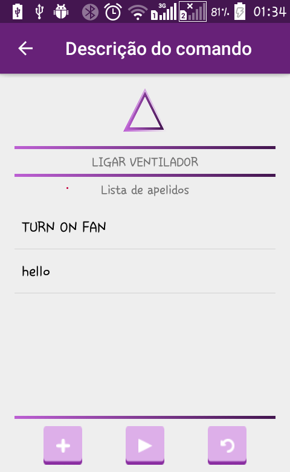
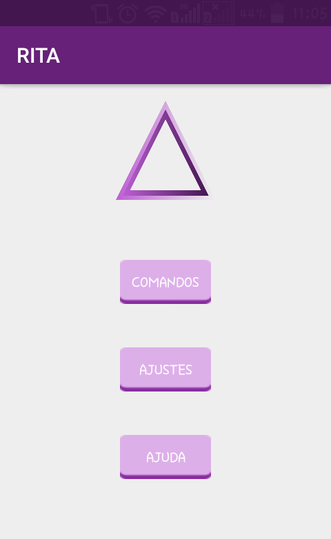
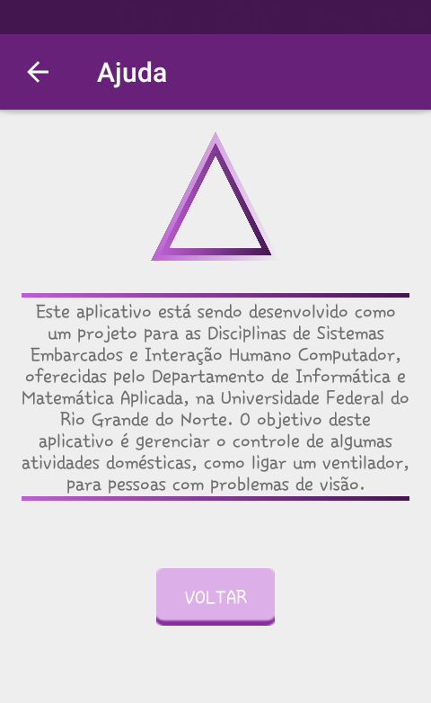
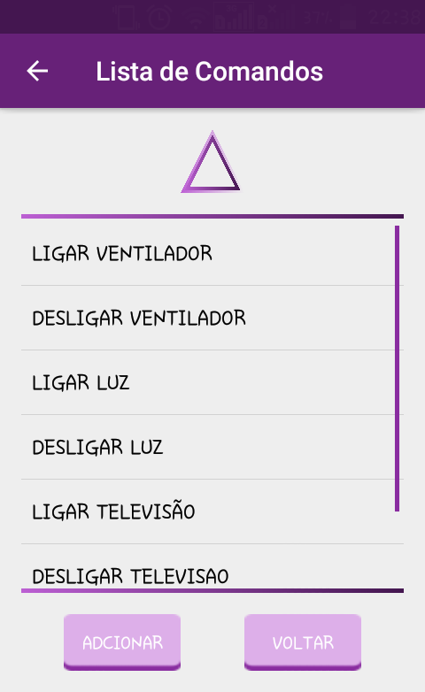
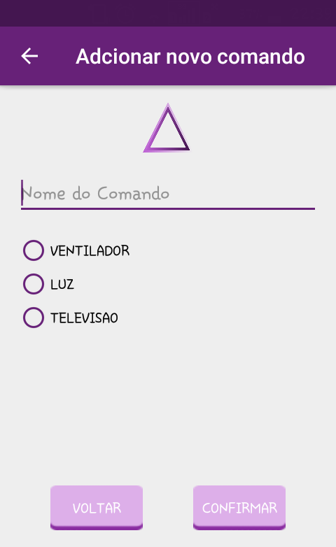
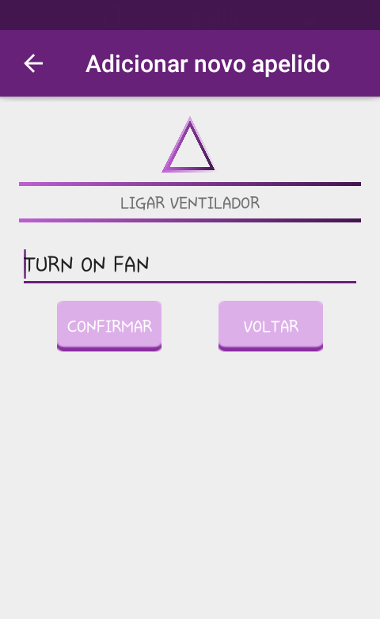

# RITA

## Description

RITA is a voice-controlled virtual assistant that performs home automation tasks. That project was developed as a work for the Embedded Systems course. The goal of RITA is to improve the life quality of people with visual disabilities. The central is responsible for perform the tasks and it was programmed using an Arduino UNO. The central is composed 
by a LED (representing the house lights), a RGB LED (representing the TV) and a engine (representing a fan). For now, the virtual assistant has support only for Android and uses the Google Speech Recognition API to realize the speech recognition.

## Preview

	

		
		
		
		
		
		
	
	

## Team

 | 
---|---
[Breno Viana](https://github.com/brenov) | [Thales Aguiar](https://github.com/thalesaguiar21)
