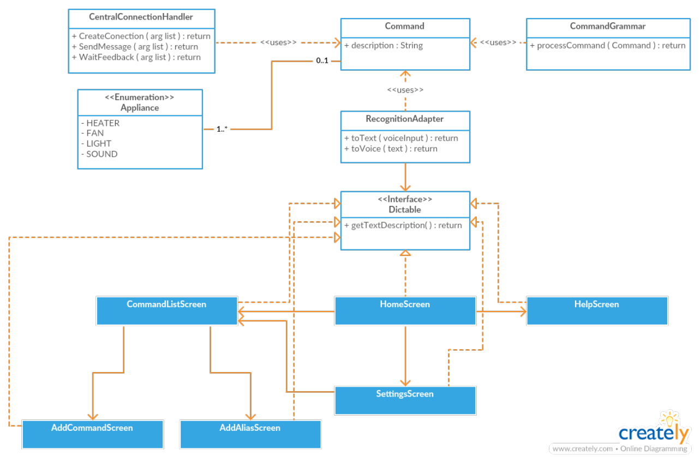

---

# RITA

## Description

RITA (Rapid Interaction Assistant for Tasks) is a voice-controlled virtual assistant that performs home automation tasks. This project was developed as a work for the Embedded Systems course. The goal of RITA is to improve the life quality of people with visual disabilities. Therefore, the application uses the accessibility feature of Android that allows reading the texts and buttons of the smartphone screen. The central is responsible for perform the tasks and it was programmed using an Arduino UNO. The central is composed by a LED (representing the house lights), a RGB LED (representing the TV) and a engine (representing a fan). For now, the virtual assistant has support only for Android and uses the Google Speech Recognition API to perform the speech recognition. The app recognizes the command, converts it to a string and sends it to the central through a Bluetooth connection. The app also allows the command registration and the creation of an alias to the commands.

## Central Components

- 1 Arduino Uno;
- 1 Protoboard 830 pins;
- 1 Common LED;
- 1 LED RGB;
- 1 Bluetooth module;
- 1 Small engine;
- 25 jumpers.

## App Class Diagram

## App Preview

	

		
		
		
		
		
		
	

## Team

 | 
---|---
[Breno Viana](https://github.com/brenov) | [Thales Aguiar](https://github.com/thalesaguiar21)
